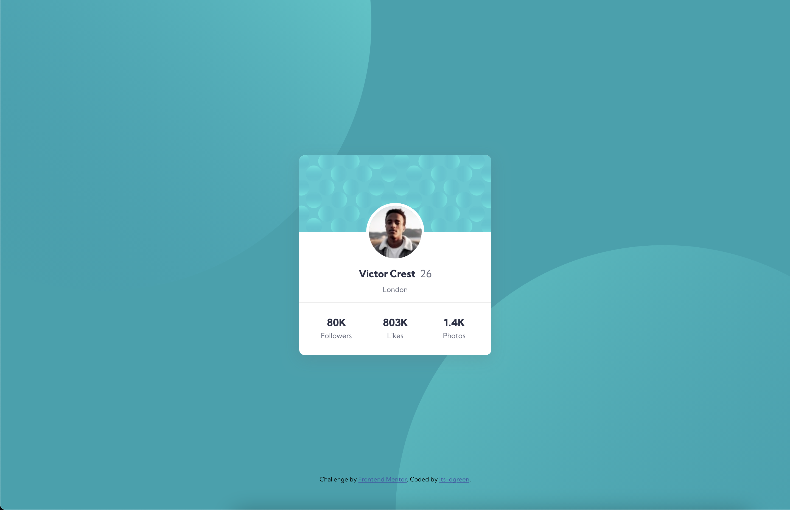
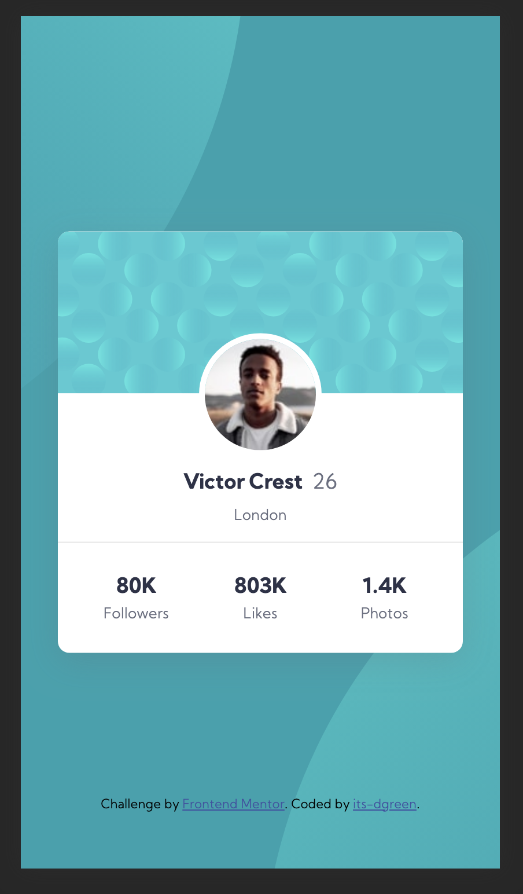

# Frontend Mentor - Profile card component solution

This is a solution to the [Profile card component challenge on Frontend Mentor](https://www.frontendmentor.io/challenges/profile-card-component-cfArpWshJ). Frontend Mentor challenges help you improve your coding skills by building realistic projects. 

## Table of contents

- [Overview](#overview)
  - [The challenge](#the-challenge)
  - [Screenshot](#screenshot)
  - [Links](#links)
- [My process](#my-process)
  - [Built with](#built-with)
  - [What I learned](#what-i-learned)
- [Author](#author)

## Overview

### The challenge

- Build out the project to the designs provided

### Desktop Screenshot

### Mobile Screenshot

### Links

- [Solution](https://your-solution-url.com)
- [Live Site](https://your-live-site-url.com)

## My process

### Built with

- Semantic HTML5 markup
- CSS Grid
- Mobile-first workflow

### What I learned

This was definitely fun to play around with, I've begun dabbling more in doing design work, and building UIs from scratch instead of just using a library like Material. Moving forward, I would like to strengthen my CSS skills.

## Author

- Website - [CtrlAltDylan](https://www.ctrlaltdylan.com)
- Frontend Mentor - [@its-dgreen](https://www.frontendmentor.io/profile/its-dgreen)
- Twitter - [@its-dgreen](https://www.twitter.com/its_dgreen)
